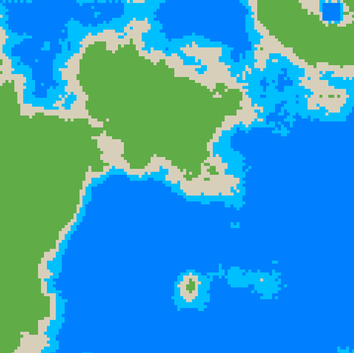
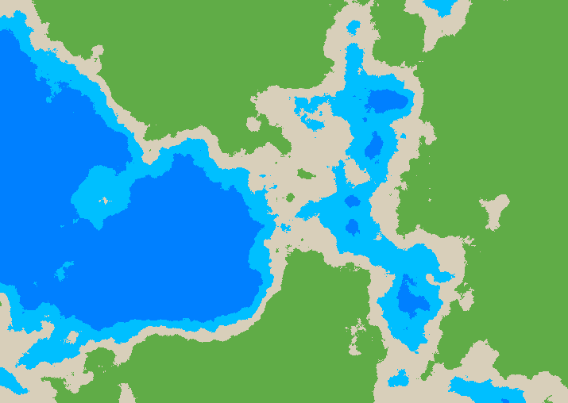

# A map generator using diamond-square algorithm.

map with size of 129 * 129

map with size of 1025 * 513

Capability and more nice-to-have-feature.
- This code can give you a map but still it has only 5 zone Deepsea, Sea, Sand, Greenland, Mountain. 
- [ ] More biome  
- [ ] More climate  
- The code cannot calculate the size to fit to screen so right. 
- [ ] Control map size  
- This code seem to lack the ability of controlling in roughness 
- [ ] Control roughness  
- You can still crash if you use weird argument so error handling is great. 
- [ ] Error handling  

    
